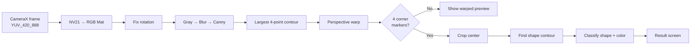

<div align="center">

# 📷 Camera OpenCV

**Real-time shape and color detection on a paper sheet, built with CameraX and OpenCV for Android**


</div>

---

## ✨ Overview

Point the camera at a sheet of paper. The app finds the sheet, straightens it, checks for **corner markers**, and then works out which **shape** is printed in the middle and what **color** it is.

| Detects | Values |
|---------|--------|
| **Shape** | Triangle · Circle · Rectangle |
| **Color** | Red · Green · Blue · Yellow · Black · White |

All processing happens on the device, frame by frame, with no network calls.

## 🧾 Target Sheet

The detector expects a sheet that looks like this:

```
┌───────────────────────────┐
│ ■                       ■ │   ■ = dark corner markers (all 4 required)
│                           │
│           ▲ / ● / ■       │   one colored shape in the center
│                           │
│ ■                       ■ │
└───────────────────────────┘
```

- The sheet must stand out from the background, so its 4 edges can be found.
- Each corner needs a **dark square marker**. The detector checks the corner zones (1/4 of the width × 1/5 of the height) for 3–40% dark pixels.
- The shape should be large, filled with color, and placed near the center on a light background.

## ⚙️ How It Works



### 1. Frame → OpenCV `Mat`
`OpenCVUtil.getMatFromImage()` combines the Y, V and U planes into an **NV21** buffer and converts it with `COLOR_YUV2RGB_NV21`. `fixMatRotation()` then rotates the image upright using `transpose` + `flip`.

### 2. Find the sheet
```kotlin
Imgproc.cvtColor(src, gray, Imgproc.COLOR_RGB2GRAY)
Imgproc.GaussianBlur(gray, blur, Size(5.0, 5.0), 0.0)
Imgproc.Canny(blur, edges, 75.0, 200.0)
Imgproc.findContours(edges, contours, Mat(), Imgproc.RETR_EXTERNAL, Imgproc.CHAIN_APPROX_SIMPLE)
```
Each contour is simplified with `approxPolyDP` (epsilon = 2% of its perimeter). The **largest contour with exactly 4 points** is taken as the sheet.

### 3. Straighten the sheet
The corners are ordered as TL, TR, BR, BL using the `x + y` and `y − x` rules. `warpSheet()` then applies `getPerspectiveTransform` + `warpPerspective` to give a flat, top-down view.

### 4. Check the markers
`Mat.hasSquares()` thresholds each corner zone (`THRESH_BINARY_INV`, 80). A sheet is accepted only when **all 4** corners contain a dark marker.

### 5. Classify
The center region (2/3 of the height × 3/5 of the width) is cropped. `findShape()` thresholds it at 200 and takes the largest contour that covers more than 2% of the area.

**Shape**: compares the contour area with its `minAreaRect` area and picks the closest ideal ratio:

| Shape | Ideal ratio | Why |
|-------|-------------|-----|
| Triangle | 0.50 | a triangle fills half of its bounding box |
| Circle | 0.785 | π / 4 |
| Rectangle | 1.00 | fills the whole box |

**Color**: takes the mean RGB of the central 1/5 × 1/5 patch and matches it against fixed thresholds in `getCenterColorName()`.

## 🛠 Tech Stack

| Category | Library |
|----------|---------|
| Language | Kotlin |
| Computer vision | [OpenCV](https://opencv.org/) `5.0.0.1` (`org.opencv:opencv` from Maven Central) |
| Camera | CameraX `1.6.1`: `Preview` + `ImageAnalysis` (`STRATEGY_KEEP_ONLY_LATEST`) |
| Permissions | [PermissionX](https://github.com/guolindev/PermissionX) `1.8.1` |
| UI | Fragments, ViewBinding + [vbpd](https://github.com/androidbroadcast/ViewBindingPropertyDelegate) `2.0.4` |
| SDK | min `24` · target/compile `37` · AGP `9.3.2` · Java 11 |

## 📂 Project Structure

```
app/src/main/java/uz/gita/cameraopencv/
├── MainActivity.kt            # Initializes OpenCV → StartScreen or ErrorScreen
└── screen/
    ├── StartScreen.kt         # "Start detection" + camera permission
    ├── CameraScreen.kt        # CameraX setup and the detection pipeline
    ├── OpenCVUtil.kt          # YUV→Mat, rotation, warp, markers, shape, color
    ├── CameraOverlayView.kt   # Draws rectangles over the preview
    ├── ResultScreen.kt        # Shows the detected shape and color
    ├── ErrorScreen.kt         # Shown if OpenCV fails to load
    └── Repository.kt          # Holds the last result
```

## 🔌 Adding OpenCV to an Android Project

OpenCV 4.9+ is published on Maven Central, so you don't need to download an SDK or set up the NDK.

```toml
# gradle/libs.versions.toml
[versions]
opencv = "5.0.0.1"

[libraries]
opencv = { module = "org.opencv:opencv", version.ref = "opencv" }
```

```kotlin
// app/build.gradle.kts
dependencies {
    implementation(libs.opencv)
}
```

Load the native library before calling any OpenCV API:

```kotlin
if (OpenCVLoader.initLocal()) {
    // OpenCV is ready
} else {
    // show an error
}
```

## 🚀 Getting Started

**Requirements:** a recent Android Studio, JDK 11+, and a physical device with a camera (Android 7.0+).

```bash
git clone <repository-url>
cd CameraOpenCV
./gradlew installDebug
```

1. Tap **Start detection** and allow camera access.
2. Point the camera at a prepared sheet (see [Target Sheet](#-target-sheet)).
3. Hold the phone steady until the result screen appears.

> 💡 **Tips:** use even lighting and a plain, contrasting background, and keep the whole sheet in the frame.

## 🔐 Permissions

| Permission | Purpose |
|------------|---------|
| `CAMERA` | Live preview and frame analysis |
